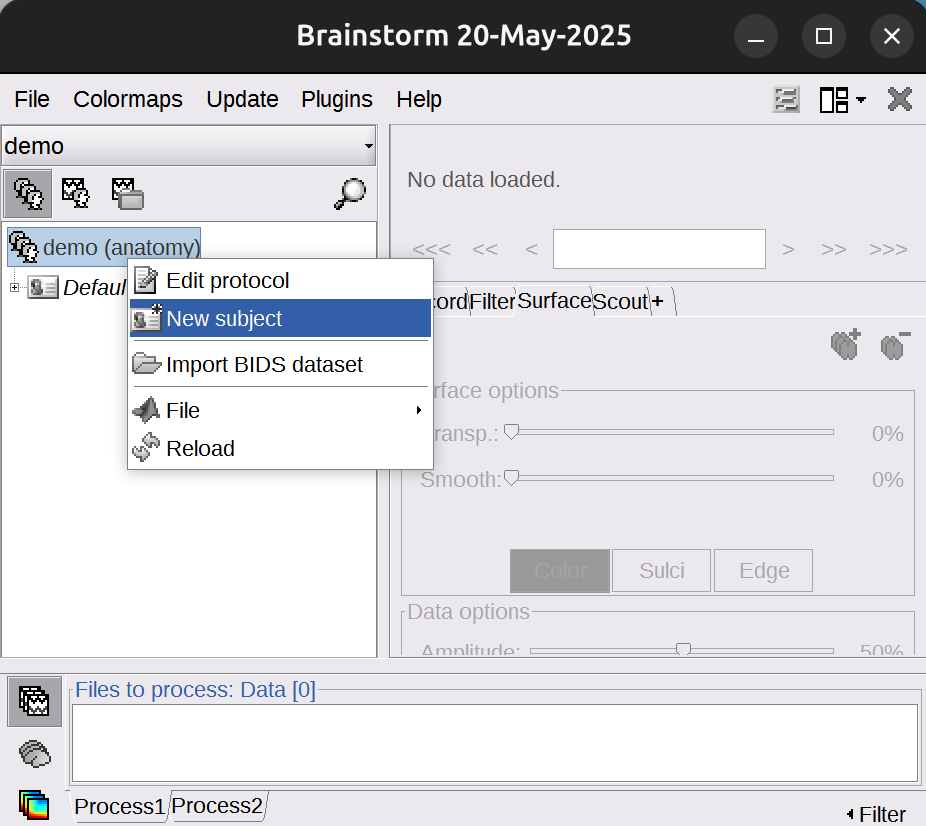
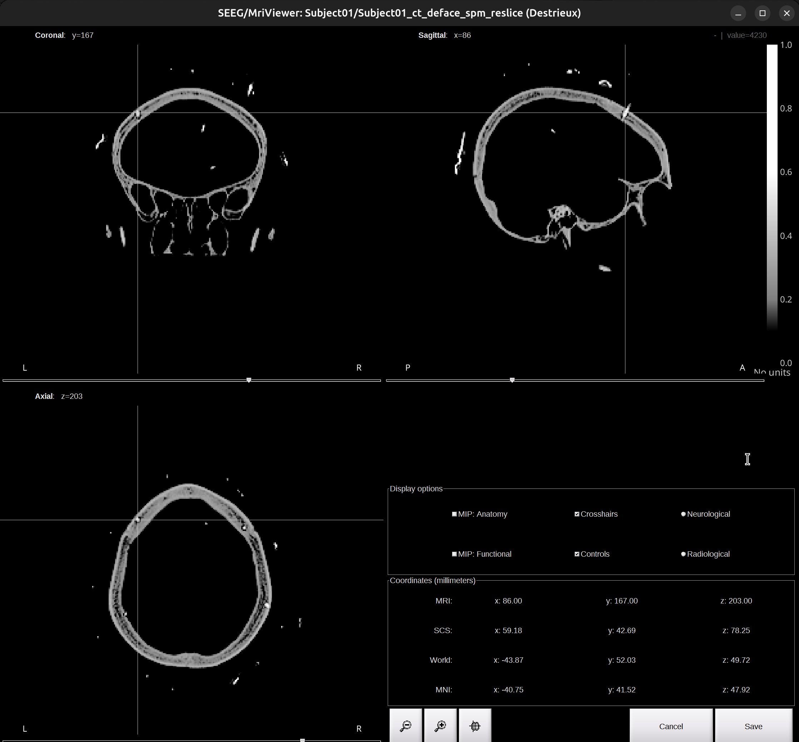

Brainstorm Tutorial - sEEG Localization
===================================================================================================

Contributor: Hao Zhu ([haozhu@cuhk.edu.hk](mailto:haozhu@cuhk.edu.hk))

Create Date: 2024/01/08

This tutorial is based on:

*   Ubuntu 24.04.2 LTS 64-bit
*   MATLAB R2024b
*   Brainstorm 20-May-2025
*   FreeSurfer 7.4.1
*   dcm2niiX v1.0.20220720 (JP2:OpenJPEG) GCC13.2.0 x86-64 (64-bit Linux)

Update History:

*   _Hao Zhu_ - 2024/01/16:

    *   With Brainstorm 03-Jan-2024. Right click `subject`, you can directly import CT.
    *   Add Extras section

*   _Hao Zhu_ - 2025/05/28:

    *   Compatible with Brainstorm 20-May-2025. 

Introduction
-----------------------------------------------

This tutorial is designed to walk through the fundamental steps of sEEG electrode localization. The process includes merging pre-operative MRI with post-operative CT scans (co-registration), normalizing the data (standardization), marking the positions of the electrodes on the co-registered CT (manual electrode localization), identifying anatomical structures (atlas labeling), and visualization.

Table of Contents
---------------------------------------------------------

1.  [Installation](#installation)
2.  [Data preparation](#data-preparation)
3.  [Getting Started](#getting-started)
4.  [Import Anatomy](#import-anatomy)
5.  [Electrode Localization](#electrode-localization)
6.  [Atlas Labeling](#atlas-labeling)
7.  [Visualization](#visualization)
8.  [Conclusion](#conclusion)
9.  [Extras](#extras)

Installation
-----------------------------------------------

Follow the [official installation guide](https://neuroimage.usc.edu/brainstorm/Installation) for detailed instructions.

Data preparation
-------------------------------------------------------

This tutorial uses a sample dataset from a subject collected from Shenzhen Second People’s Hospital. All neuroimages of this subject have been defaced with informed consent.

1.  pre-operative MRI

*   `dataset/NifTi/Subject01_mri_deface.nii`
    
    
    

2.  post-operative CT

*   `dataset/NifTi/Subject01_ct_deface.nii`
    
    
    

3.  Co-registered images (Done and provided by neurosurgeons)
    
*   OPTIONAL: Inside the folder, there are subfolders named under the labels of implanted electrodes (eg. `dataset/coreg_map/A'/`). In each of the subfolder, there are images displaying the position of the contact demonstrated by MRI and CT scans overlay (eg. `dataset/coreg_map/A'/A'(1).png`).
        
*   There is a slide file (`dataset/Subject01_electrodemap.pptx`) that describes the electrode implantation in both hemisphere.
    
    {width=40%, height=40%} 
    {width=40%, height=40%}
    

4.  FreeSurfer reconstruction

*   The open-source software FreeSurfer can be used to extract the cortical envelope from a T1/T2 MRI and register it to an atlas.

*   Files that are used by brainstorm:
    *   `dataset/Subject01/mri/T1.mgz` (T1 MRI volume) + optional /mri/T2.mgz
    *   `dataset/Subject01/mri/*aseg.mgz` (volume parcellations)
    *   `dataset/Subject01/surf/?h.pial` (grey/csf interface)
    *   `dataset/Subject01/surf/?h.white` (grey/white matter interface)
    *   `dataset/Subject01/surf/?h.sphere.reg` (registered parametrized sphere, for subject co-registration)
    *   `dataset/Subject01/label/?h.*.annot` (cortical surface-based atlases)
    *   `dataset/Subject01/surf/?h.thickness` (cortical thickness map)

*   `dataset/Subject01/`, created by FreeSurfer using T1/T2 MRI image (e.g. `dataset/NifTi/Subject01_mri_deface.nii`).Read "[Extras](#extras)" Section for more detail.

Above four files are needed for this tutorial and successful electrode localization. Example files are available on request.

Getting Started
-----------------------------------------------------

1.  Launch brainstorm ([Guide](https://neuroimage.usc.edu/brainstorm/Installation#Start_Brainstorm))
    
2.  From the main window choose `File` ▸ `New Protocol`. Give the protocol a name, then choose::
    
*   **No, use individual anatomy**
*   **No, use one channel file per acquisition run**
    
    {width=40%, height=40%} {width=43%, height=43%}
    

Import Anatomy
---------------------------------------------------

Import neuroimages into Brainstorm.

1.  Create subject

*   Right-click on the protocol folder > `New subject` > `Subject01`. Keep the default options you defined for the protocol: **No, use individual anatomy**; **No, use one channel file per acquisition run**
    
    {width=30%, height=30%} {width=33%, height=33%} {width=30%, height=30%}
    

2.  Import FreeSurfer anatomy folder

*   Right-click on the subject `Subject01` > `import anatomy folder` > `dataset/Subject01/`. Leave `Files of type` set to **FreeSurfer + Volume atlases**.
    
*   Use default Number of vertices on the cortex surface: 15000
    
*   The MRI viewer opens automatically. The anatomical fiducials are undefined at this point; they will be set in the next step. 

	{width=90%, height=90%}
    
*   Click on `Click here to compute MNI normalization`, select option `segment`. It computes a non-linear transformation between the subject space and the MNI ICBM152 space. It takes a while for this computation and the fiducials will be automatically defined after this computation. 
	
	{width=90%, height=90%}
    
*   Check fiducials, follow this [instruction](https://neuroimage.usc.edu/brainstorm/CoordinateSystems). Click `Save` to finish.
    
*   The files you can see in the database explorer:
    
    *   MRI T1: The T1 MRI of the subject
    *   ASEG/DKT/Desikan-Killiany/Destrieux/tissues\_segment: Volume parcellations, recommend to use **Destrieux**.
    *   head mask: Scalp surface generated by Brainstorm. The numbers in the filename indicate the parameters that were used for this head: vertices=10000, erode factor=0, fill holes=2, background threshold=detected.
    *   mid\_\*V: Mid-cortex surfaces (average of the pial + white surfaces vertex by vertex)
    *   cortex\_269368V: High-resolution pial surface that was generated by FreeSurfer, that contains usually between 200,000 and 300,000 vertices.
    *   cortex\_15002V: Low-resolution pial surface, downsampled using the reducepatch function from Matlab. It is used as the default by the processes that require a cortex surface.
    *   white\_269368V: High-resolution white matter envelope from FreeSurfer
    *   white\_15002V: Low-resolution white matter, processed with reducepatch
    *   subcortical: Atlas of subcortical regions imported as labelled surfaces
        
        {width=50%, height=50%}
        

3.  import CT scan

*   Right-click on the subject `Subject01` > `import CT` > `dataset/NifTi/Subject01_ct_deface.nii`.
    
*   Click `SPM` for co-registration window (1st). Click `Yes` to 2nd reslice window. Click `Skip` to 3rd skull stripping window.
    
*   Check co-registration result, close the Viewer window.
    
    {width=90%, height=90%}
    
*   \[optional\] Right click the `Subject01_ct_deface_spm_reslice` > `File` > `Rename` > `CT`
    

The import step is finished. MRI and CT are co-registered and normalized.

Electrode Localization
-------------------------------------------------------------------

Identify and mark the positions of the electrodes on the co-registered CT scan.

1.  Create implantation.

*   Right-click on the subject `Subject01` > `SEEG/ECOG implantation`
    
*   In the pop-up window, we can select which volumes (MRI/CT/MRI+CT) to do localization. I recommend using the `CT` volume. Click `CT` or `MRI+CT` and a Viewer window will pop up like this:
    
    {width=90%, height=90%}
    
*   **Do not close the Viewer!** It’s needed for the whole process of localization.
    
2.  Start localization

*   In the right panel of the brainstorm UI, under the `iEEG` tab. Click `+` to add an electrode (click `-` to delete). 
    
    {width=40%, height=40%}
        
*   Let’s start with one example electrode: **X**.
    
    *   The order matters, my recommendation is start with the hemisphere that has fewer electrodes, move from anterior to posterior. Value **coronal** image since most electrodes are implanted from left/right side of the brain.
    *   Select correct electrode parameter, for instance in this case: `Huake-Hengsheng SDE-08-S16`. Change `Number of contacts` according to how many contacts this electrode has, in this case: 16. If the number of contacts exceeds 16, change `Electrode length` to 100 mm to accommodate longer shafts.
        
    	{width=40%, height=40%}
        
    *   Check the Viewer window of the CT scan. Find the tip of the **X** electrode, put the cross at the tip. Use zoom in/out for help, and take image in `dataset/Subject01_electrodemap.pptx` for reference. Once confirmed the tip, go back to the brainstorm UI, click `Set tip`.

        {width=90%, height=90%}
                
    *   Again, check the Viewer window of the CT scan and find the skull entry of the **X** electrode, put the cross at it. Make sure the point selected is outside of the skull. Once confirmed the skull entry, go back to the brainstorm UI, click `Set skull entry`.
        
        {width=90%, height=90%}
                    
    *   Check the Viewer window of the CT scan. Scroll around, you can see the electrode **X** has been localized.
        
        {width=90%, height=90%}
        

3.  Repeat the Step 2 for the rest electrodes.

*   Once finished localization, click `Save` on the right corner of the Viewer window.
*   Click `Yes` for the pop-up Channel editor window.

Atlas labeling
---------------------------------------------------

After electrode localization, we have the correct coordinates of each contact. We can identify contact’s anatomical location in either native space (Destrieux atlas) or MNI space (AAL3 atlas). To identify the correct anatomical location of a contact, combine both labeling results and compare to actual neural signal.

1.  Native space

*   In functional data section, right-click on the `Subject01-Implantation-SEEG/ECOG(###)` > `iEEG atlas labels`. Select the output directory, and name the file `Subject01.tsv`. Click `OK`, then confirm with `Yes` for subsequent pop-up. The generated file will open.
    
    {width=90%, height=90%}
    
*   This file contains contact’s coordinates and anatomical labeling in different atlases and corresponding probability. I recommend to use **Destrieux**.
    

2.  MNI space

*   In functional data section, right-click on the subject `Subject01-Implantation-SEEG/ECOG(###)` > `Project to default anatomy`.
    
*   In functional data section, right-click on the subject `Group_channels-Subject01-SEEG/ECOG(###)` > `iEEG atlas labels`. Select directory you wish to export, and name it `Subject01_mni.tsv`. Click `OK` and `Yes` for the rest pop-up window. The generated file will open.
        
*   This file also contains contact’s coordinates and anatomical labeling in different atlases and corresponding probability. But note it’s all in MNI space. I recommend to use **AAL3**.
    

Visualization
-------------------------------------------------

You can use Brainstorm’s built-in tools or external libraries; however, `mayavi` and `pysurfer` are deprecated in my workflow.

1.  brainstorm

*   Native space. In functional data section, right-click on the subject `Subject01-Implantation-SEEG/ECOG(###)` > `Display sensors` > `SEEG (Cortex)`. Adjust level of transparency of the cortex under the `Surface` tab. Display atlas labels and contours under the `Scout` tab > `Atlas` > `From subject anatomy` > `Destrieux`. To generate movie, in the 3D view window, right-click, select `Snapshot` > `Movie (horizontal/vertical)`.
    
    {width=80%, height=80%}
    
*   MNI space. In functional data section, right-click on the subject `Group_channels-Subject01-SEEG/ECOG(###)` > `Display sensors` > `SEEG (Cortex)`.
    

2.  PyVista

*   Brainstorm currently lacks true group-level electrode visualization (a common workaround is to pool coordinates into a pseudo-subject).
*   `PyVista` is a powerful 3D visualization toolkit in `Python` that enables researchers to easily create complex and interactive 3D models. It is particularly notable for its capabilities in brain visualization, allowing for the detailed and interactive rendering of brain structures and data in a 3D space.`MNE-python` currently implement PyVista as brain plot backend.
*   Extract the MNI coordinates computed from brainstorm and read it to `numpy` arrays.
*   Use `FreeSurfer` **fsaverage** as template.
    
    {width=70%, height=70%}
    

Conclusion
-------------------------------------------

Congratulations — you have completed the Brainstorm tutorial for sEEG electrode localization. This is just the beginning—continue exploring advanced features and analyses to enhance your sEEG research.

Feel free to check the [official tutorial](https://neuroimage.usc.edu/brainstorm/Tutorials/Epileptogenicity) for more in-depth information and advanced topics.

Happy brain mapping!

Extras
-----------------------------------

1.  Convert DICOM images to NifTi file.
    
    `dcm2niix -o __output_file_path__ -f %i_%n_%p_%s_%t -z y __image_folder_path__`
    
    * o: output directory
    * z y: output compressed = .nii.gz
    * f: output name
    * %i: patient id
    * %n: subject name
    * %p: protocol name
    * %s: series
    * %t: session date and time
    
2.  Run FreeSurfer reconstruction.
    

*   Set up FreeSurfer environment
    
    ```
    export FREESURFER_HOME=/INSTALL_PATH/freesurfer
    export SUBJECTS_DIR=/INSTALL_PATH/freesurfer/subjects
    source /INSTALL_PATH/freesurfer/SetUpFreeSurfer.sh
    ```
    
*   Run recon-all. Approx 2 hours on 14600K, 1.2-1.5 hours on 13900K.
    
    `recon-all -i __NII_FILE_PATH__ -subjid __SUBJECT_ID__ -all`

*   Check MRI/CT NifTI file, use Freeview that is installed alone with FreeSurfer.
    
    `freeview`